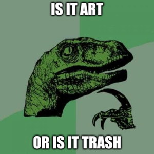

# Art or Trash?

**Predicted : trash**


**Predicted : abstract**


Can that age old question of art or trash be settled with a convolutional neural network?
Surely all matters regarding implicit beauty and subjectivity of human perception can be boiled down to a matrix of RGB fed mercilessly through a greater understanding of art.
Step right up and resolve your conflicting intuitions by putting the difficult questions into the arguments of a machine learning tool!


```bash
# generating the truth
./art_or_trash -i path_to_judge_mercilessly.jpg

# generating the truth from a different perspective (there are quite a few to choose from)
./art_or_trash -p models/mdl_0.01lr_0.6m.pt -i path_to_judge_with_some_mercy.jpg

# retraining model with your own personal truth
./art_or_trash -t -l 0.001 -m 0.8 -e 15 -p model.pt
./art_or_trash -p model.pt -i path_to_judge_mildly.jpg
```


## Dependencies
- pandas
- numpy
- torch
- torchvision
- seaborn (if running hyperParamComparison.py)
