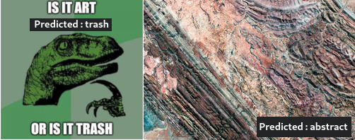

# Art or Trash?


**Step right up and resolve your conflicting intuitions with arguments to a machine learning tool!**


## Can it be so?
Can that age old question of art or trash be settled with a convolutional neural network?
Surely all matters regarding implicit beauty or the subjectivity of human perception can be boiled down to a matrix of values representing RGB and fed mercilessly through a greater understanding of art.

## How can it be?
I've trained a CNN on a large set of artworks of various genres and a swarm of the trashiest of internet trash memes. If you can trust google's definition of artwork genres, and you can trust that internet trash is in fact trash then you are in the right place

## Who would make something like this?
I believe that random google earth photography is incredibly beautiful and something I personally would consider art. I could only agree with others that memes are trash, and that art is not generally trash. To prove my point I need only to show that these images are more closely related to artwork than they are internet trash memes.

##  Fine, how do I use it?
```bash
# generating the truth
./art_or_trash -i path_to_judge_mercilessly.jpg

# generating the truth from a different perspective (there are quite a few to choose from)
./art_or_trash -p models/mdl_0.01lr_0.6m.pt -i path_to_judge_with_some_mercy.jpg

# retraining model with your own personal truth
./art_or_trash -t -l 0.001 -m 0.8 -e 15 -p model.pt
./art_or_trash -p model.pt -i path_to_judge_mildly.jpg
```


## Dependencies
- pandas
- numpy
- torch
- torchvision
- seaborn (if running hyperParamComparison.py)
